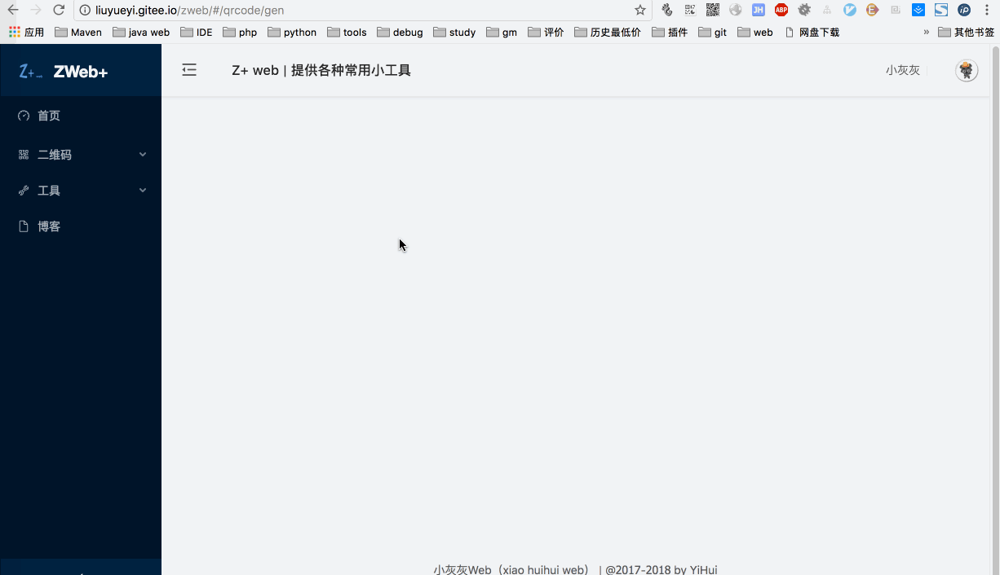

# quick-media

[](https://gitter.im/quick-media/Lobby?utm_source=badge&utm_medium=badge&utm_campaign=pr-badge&utm_content=badge)
[](https://travis-ci.org/liuyueyi/quick-media)
[](https://jitpack.io/#liuyueyi/quick-media)
[](https://search.maven.org/search?q=g:com.github.liuyueyi.media)
[](https://codecov.io/gh/liuyueyi/quick-media)
[](http://isitmaintained.com/project/liuyueyi/quick-media "Average time to resolve an issue")
[](http://isitmaintained.com/project/liuyueyi/quick-media "Percentage of issues still open")

> 多媒体处理web服务
>
> mult-media process Web Service by FFMPEG & ImageMagic & SpringMVC
 
本项目为一个提供图片 + 音频 + 视频 + 二维码 + 网页 + markdown处理的Web项目，我们的目标是封装一套多媒体文件处理的公共类库，简化各种复杂的调用；利用 spring-boot 来提供http接口实现多媒体的操作实例功能

整理了下QuickMedia的使用与技术文档，可以通过下面的链接进行查看

- [http://liuyueyi.gitee.io/quick-media/#/](http://liuyueyi.gitee.io/quick-media/#/)
- [https://liuyueyi.github.io/quick-media/#/](https://liuyueyi.github.io/quick-media/#/)

线上体验地址

- Z+ | web : [http://media.hhui.top](http://media.hhui.top)

### 使用说明

目前最新版jar包已提交到maven仓库，因此想直接引入的小伙伴，不需要再采用下面的两种方案了（请注意jitpack的包通常来讲更新会更频繁些，而中央仓库的会更稳定些；相同的版本号对应的代码保持一致）

中央仓库引入地址: [https://mvnrepository.com/artifact/com.github.liuyueyi.media](https://mvnrepository.com/artifact/com.github.liuyueyi.media)

举例如二维码插件的依赖如下即可

```xml
<!-- https://mvnrepository.com/artifact/com.github.liuyueyi.media/qrcode-plugin -->
<dependency>
    <groupId>com.github.liuyueyi.media</groupId>
    <artifactId>qrcode-plugin</artifactId>
    <version>2.6.1</version>
</dependency>
```

---

在下载本项目之后，有些常见事项需要注意一二

- ~~工程中使用lombok简化大量的代码，因此使用idea的童鞋请装一下lombok的插件(最新版已移除lombok依赖)~~
- 部分插件依赖第三方库，如 ffmpge, phantomjs, image-magic，请确保已经安装

**jitpack使用方式**

由于某些原因，导致github访问太慢，无法下载依赖包时，这里也给出了第二种选择方案，借助`jitpack`仓库，详情使用文档，请查看：[quick-media jitpack-仓库导入](https://github.com/liuyueyi/quick-media/#/%E8%BF%AD%E4%BB%A3/%E6%9B%B4%E6%96%B0%E6%97%A5%E5%BF%97?id=b-jitpack-%e4%bb%93%e5%ba%93)


一个简单的示例如下:

```xml
<repositories>
    <repository>
        <id>jitpack.io</id>
        <url>http://jitpack.io</url>
    </repository>
</repositories>


<!-- 请注意groupId和github的方式有一些区别哦 -->
<dependency>
    <groupId>com.github.liuyueyi.quick-media</groupId>
    <artifactId>qrcode-plugin</artifactId>
    <version>2.6.1</version>
</dependency>
```

## I. 项目分析

### 1. 技术栈

- spring-boot 
- ffmpeg
- ImageMagic
- zxing
- batik
- flexmark
- phantomjs

### 2. 结构分析

目前项目主要结构区分为web/plugins两个模块，

#### web

- 根据spring-boot可以迅速搭建一个web服务，提供http接口用于功能测试
- 内部集成了一个简单的web网站，打开: [http://media.hhui.top:8089/media/webs](http://media.hhui.top:8080/media/webs) 查看
- 使用ReactJS，前后端分离，写了一个更友好的网站，打开: [https://zweb.hhui.top/#/index](https://zweb.hhui.top/#/index) 查看
- 内部实现了小程序【图文小工具】的后端逻辑


#### plugins 

插件工程，根据不同的场景，支持不同的服务功能，目前将所有的插件抽象出来，可以独立作为工具包提供给第三方依赖，直接引入使用

**audio-plugin**

提供音频转码服务，使用依赖如下，详细查看: [audio-plugin说明](plugins/audio-plugin/readme.md)

中央仓库导入方式，注意groupId不同(为什么需要改变groupId? 因为上传到maven中央仓库，要求groupId与github的项目所属相同)

```xml
<!-- https://mvnrepository.com/artifact/com.github.liuyueyi.media/audio-plugin -->
<!-- 请注意最新报，请直接到maven中央仓库查看，或者到迭代日志中获取 -->
<dependency>
    <groupId>com.github.liuyueyi.media</groupId>
    <artifactId>audio-plugin</artifactId>
</dependency>
```


**date-plugin**

提供时间戳、日期转换为农历日期，详细查看：[date-plugin说明](plugins/date-plugin/readme.md)

```xml
<!-- https://mvnrepository.com/artifact/com.github.liuyueyi.media/date-plugin -->
<dependency>
    <groupId>com.github.liuyueyi.media</groupId>
    <artifactId>date-plugin</artifactId>
</dependency>
```


**image-plugin**

提供图片合成，提供gif图片生成等图片操作的封装类，详细查看： [image-plugin说明](plugins/image-plugin/readme.md)


```xml
<!-- https://mvnrepository.com/artifact/com.github.liuyueyi.media/image-plugin -->
<dependency>
    <groupId>com.github.liuyueyi.media</groupId>
    <artifactId>image-plugin</artifactId>
</dependency>
```


**markdown-plugin** 

markdown转html，转图片的封装类， 详细内容查看: [markdown-plugin](plugins/markdown-plugin/readme.md)


```xml
<!-- https://mvnrepository.com/artifact/com.github.liuyueyi.media/markdown-plugin -->
<dependency>
    <groupId>com.github.liuyueyi.media</groupId>
    <artifactId>markdown-plugin</artifactId>
</dependency>
```

**phantom-plugin**

提供根据phantomjs渲染html的封装


```xml
<!-- https://mvnrepository.com/artifact/com.github.liuyueyi.media/phantom-plugin -->
<dependency>
    <groupId>com.github.liuyueyi.media</groupId>
    <artifactId>phantom-plugin</artifactId>
</dependency>
```

**qrcode-plugin**

提供二维码生成和解析的封装，详细查看: [qrcode-plugin使用说明](plugins/qrcode-plugin/readme.md)

> [qrcode使用手册](https://liuyueyi.github.io/quick-media/#/%E6%8F%92%E4%BB%B6/%E4%BA%8C%E7%BB%B4%E7%A0%81/%E4%BA%8C%E7%BB%B4%E7%A0%81%E6%8F%92%E4%BB%B6%E4%BD%BF%E7%94%A8%E6%89%8B%E5%86%8C)


```xml
<!-- https://mvnrepository.com/artifact/com.github.liuyueyi.media/qrcode-plugin -->
<dependency>
    <groupId>com.github.liuyueyi.media</groupId>
    <artifactId>qrcode-plugin</artifactId>
</dependency>
```

**svg-plugin**

提供svg文档的渲染，输出图片的封装，详细查看: [svg-plugin使用说明](plugins/svg-plugin/readme.md)


```xml
<!-- https://mvnrepository.com/artifact/com.github.liuyueyi.media/svg-core -->
<dependency>
    <groupId>com.github.liuyueyi.media</groupId>
    <artifactId>svg-core</artifactId>
</dependency>
```


**imagic-plugin**

基于imagic-magic实现的图片编辑插件封装，详细查看: [imagic-plugin使用说明](plugins/imagic-plugin/readme.md)


```xml
<!-- https://mvnrepository.com/artifact/com.github.liuyueyi.media/imagic-plugin -->
<dependency>
    <groupId>com.github.liuyueyi.media</groupId>
    <artifactId>imagic-plugin</artifactId>
</dependency>
```


## II. 已支持服务

### 1. 音频转码
   - [x] 音频不同格式的相互转码

### 2. 二维码生成 & 解析

- [x] 二维码生成
- [x] 个性二维码生成
    - 支持logo
    - 支持logo样式 （圆角logo， 边框）
    - 支持二维码颜色设置
    - 支持二维码圆角
    - 支持探测图形颜色设置
    - 支持探测图形图片定制
    - 支持背景图
    - 支持背景图圆角设置
    - 支持base64格式的二维码图片
    - 支持二维码定制绘制信息样式
     - 三角形
     - 矩形
     - 五边形 （五角星待支持）
     - 六边形
     - 八边形
     - 圆
     - 自定义图片
    - 前置图支持
- [x] 动态二维码生成支持
- [x] 二维码信息解析

[查看更多二维码详情](https://liuyueyi.github.io/quick-media/#/插件/二维码/二维码插件使用手册)

<font color="red">最新版本2.5.4，详情查看 [迭代日志](https://liuyueyi.github.io/quick-media/#/%E8%BF%AD%E4%BB%A3/%E6%9B%B4%E6%96%B0%E6%97%A5%E5%BF%97?id=_27-qrcode-plugin)</font>

给出一个实际生成的case如下:


### 3. 图片

- [x] 长图文生成
   - [水平文字，上下布局长图文生成](https://liuyueyi.github.io/quick-media/#/插件/image/Java实现长图文生成)
   - [垂直文字，左右布局长图文生成](https://liuyueyi.github.io/quick-media/#/插件/image/Java实现竖排长图文生成)
   - 第三方字体支持
- [x] markdown 转 image
    - [markdown 转 html](https://liuyueyi.github.io/quick-media/#/插件/markdown/markdown转html)
    - [html 转 image](https://liuyueyi.github.io/quick-media/#/markdown转image)
    - [利用phantomjs实现html转image](https://liuyueyi.github.io/quick-media/#/插件/phantom/Java&PhantomJs实现html输出图片)
- [x] gif图生成
- [x] 合成
    - [图片合成支持](https://liuyueyi.github.io/quick-media/#/插件/image/图片合成)
- [x] 水印
- [x] svg渲染
- [x] 裁剪
- [x] 压缩
- [x] 旋转
- [x] 缩放
- [ ] 格式转换


[查看更多图片服务详情](https://liuyueyi.github.io/quick-media/#/插件/image/使用手册)
    
### 4. 视频相关
- [ ] 视频压缩
- [ ] 转码
- [ ] 截取
- [ ] 码率调整
- [ ] 生成gif


## III. 阶段记录

详情查看: [quick-media更新迭代日志](https://liuyueyi.github.io/quick-media/#/%E8%BF%AD%E4%BB%A3/%E6%9B%B4%E6%96%B0%E6%97%A5%E5%BF%97)

## IV. 文档

所有使用以及技术文档，开发过程中一些常见问题汇总，可以点击👉: [quick-media文档](https://liuyueyi.github.io/quick-media/#/) 

### 问题记录汇总

- [图片旋转不生效问题](https://liuyueyi.github.io/quick-media/#/采坑/图片旋转问题修复)
- [markdonw转图片中文乱码问题](https://liuyueyi.github.io/quick-media/#/采坑/markdown转图片中文乱码)
- [兼容ImageIO读取jpeg图片变红](https://liuyueyi.github.io/quick-media/#/采坑/Batik渲染png图片异常的bug修复)
- [Batik渲染png图片异常的bug修复](https://liuyueyi.github.io/quick-media/#/采坑/兼容ImageIO读取jpeg图片变红)


## V. 其他

### 其他

看到下面的star走势图，难道真的没有动心点点🖱小小的👍一下么 

[](https://starchart.cc/liuyueyi/quick-media)

### 声明

尽信书则不如，已上内容，一家之言，因个人能力有限，难免有疏漏和错误之处，如发现bug或者有更好的建议，欢迎批评指正，不吝感激

- 微博地址: 小灰灰Blog
- QQ： 一灰灰/3302797840
- WeChat: 一灰/liuyueyi25

### 扫描关注

**打赏列表**

> 1一分也是❤️，感谢大佬的打赏 (打赏的小伙伴不妨留个备注名)

- [datouliang](https://github.com/datouliang)
- [*桑]()

**公众号&博客**


**打赏码**


---

### 实例演示

#### 0. 应用网站

项目本身提供一个控制台，基于reactjs搭建，在console模块下，启动即可

- [http://localhost:8089](http://localhost:8089)


使用react.js重构后的前端网站，实现前后端分离，前端网页借助gitee的pages直接部署，测试链接

- gitee静态页面: [http://liuyueyi.gitee.io/zweb](http://liuyueyi.gitee.io/zweb)
- <del> [https://zweb.hhui.top/#/index](https://zweb.hhui.top/#/index) 服务器hold不住，后端逻辑已下线😭 </del>


web实际演示图: 


