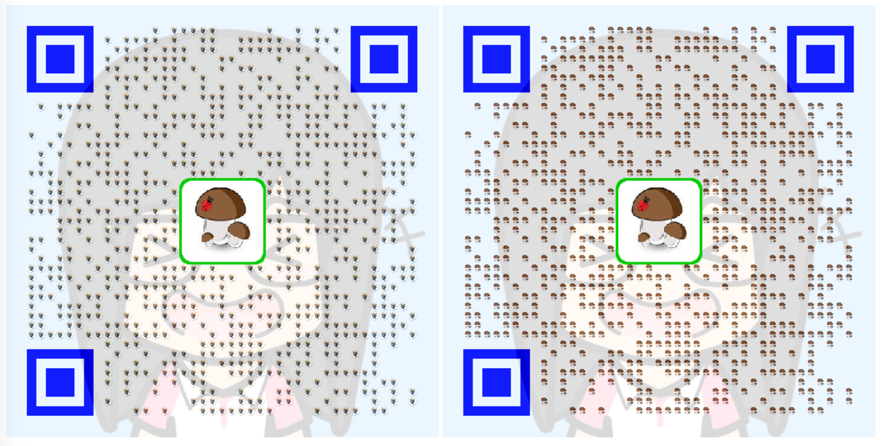
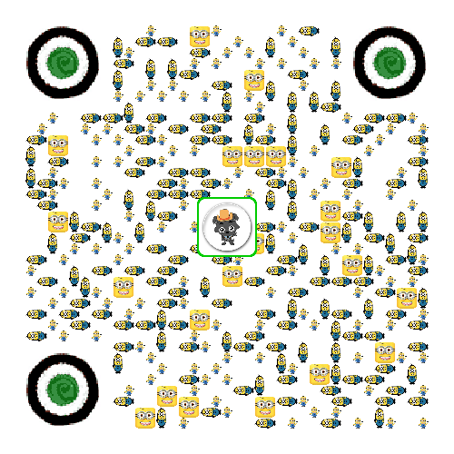

## 二维码服务

QuickMedia 针对二维码服务进行了深度定制，目前支持一下功能

- 支持logo
    - 支持圆角logo，普通logo
    - 支持logo边框
    - logo边框颜色可指定
- 支持二维码颜色设置
- 支持探测图形颜色设置
    - 外圈色，内圈色
    - 图片代替
- 支持背景图
    - 设置透明度显示背景图，二维码全覆盖
    - 二维码主题色，由背景图渲染
    - 在背景图指定位置绘制二维码
- 支持二维码定制绘制信息样式
    - 三角形
    - 矩形
    - 五边形 （五角星待支持）
    - 六边形
    - 八边形
    - 圆
    - 自定义图片
- 支持生成base64格式的二维码图片
- 支持二维码信息解析


### 使用示例

```java
@Test
public void testGenColorCode() {
    String msg = "http://blog.zbang.online:8080";
    // 根据本地文件生成待logo的二维码， 重新着色位置探测图像
    try {
        String logo = "mg.jpg";
        String bg = "bg.png";
        BufferedImage img = QrCodeGenWrapper.of(msg)
                .setW(500)
                .setDrawPreColor(0xff002fa7) // 宝石蓝
                .setDetectOutColor(0xff00ff00)
                .setDetectInColor(0xffff0000)
                .setPadding(1)
                .setErrorCorrection(ErrorCorrectionLevel.H)
                .setLogo(logo)
                .setLogoStyle(QrCodeOptions.LogoStyle.ROUND)
                .setLogoBgColor(0xff00cc00)
                .setBgImg(bg)
                .setDrawStyle(QrCodeOptions.DrawStyle.IMAGE.name())
                .setDrawImg("xhrSize4.jpg")
                .asBufferedImage();


        ByteArrayOutputStream outputStream = new ByteArrayOutputStream();
        ImageIO.write(img, "png", outputStream);
        String img64 = Base64Util.encode(outputStream);
        System.out.println("");
    } catch (Exception e) {
        System.out.println("create qrcode error! e: " + e);
        Assert.assertTrue(false);
    }
}
```


### 生成示例

基本的样式：前置色（宝蓝） + 三定位颜色（蓝色）+ logo + logo边框 + logo圆角 + 背景图 + 着色样式（三角形，矩形，五边形，六边形，八边形，圆形）
  
  
  
 
自定义图片：使用自定义的图片来代替传统的纯色 （建议jpg格式非透明的图片）
  
  
  
 
深度定制：二维码上的所有信息都可以进行自定义替换，如下
 
  
  
  
背景图样式渲染: 使用背景图的样式代替二维码样式
   
   
背景图:
   
   

   
二维码:
   
      
  
  